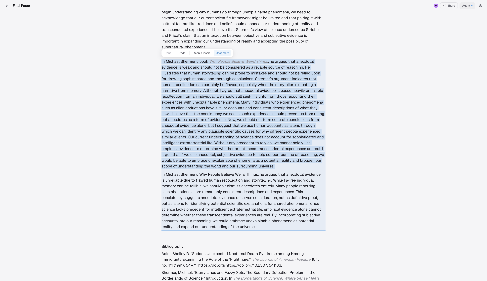
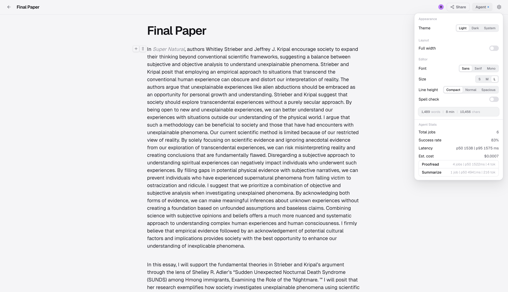

# CoWrite

CoWrite is a real-time collaborative editor that integrates asynchronous AI into live documents while preserving consistency.

AI systems operate on snapshots. Collaborative editors change continuously. This creates a correctness problem where generated edits can target content that no longer exists or has shifted.

CoWrite addresses this with a structured execution and validation model:

- Snapshot-based execution isolates AI from live edits
- Structured proposal ops replace direct text mutation
- Two-phase validation prevents stale or invalid changes
- CRDT-based sync ensures convergence across clients

The result is a system where AI suggestions remain consistent, reviewable, and safe under concurrent editing.

---

## Key Problems Solved

### Async AI vs Live Editing

AI runs on a frozen snapshot while users continue editing. Generated results are applied only if the document still satisfies the original assumptions.

### Stale Edit Prevention

Edits reference specific blocks and expected content. Validation ensures that changes are only applied when the document state matches those expectations.

### Multi-User Consistency

Yjs CRDT replication allows concurrent edits across clients without centralized transforms. The system converges automatically.

### Safe AI Integration

AI produces structured operations instead of raw text. This allows deterministic validation and controlled application.

---

## Screenshots

### Landing Page

### Agent Job Result

### Inline AI Edit Example

### Collaboration State Between Two Users

### Agent Stats and Observability

---

## Architecture

### System Overview

CoWrite consists of three components:

- React and TipTap client for editing, inline AI, and proposal review
- Node.js server for auth, access control, APIs, SSE, and Yjs sync
- Background worker for asynchronous agent execution

Document state is stored as Yjs updates in SQLite. This preserves the full CRDT state and allows reconstruction of the latest document without converting to plain text.

---

### Agent Job Lifecycle

Agent execution is decoupled from the editor:

1. User submits an agent task
2. Server captures a snapshot and stores a pending job
3. Worker claims the job atomically and executes it
4. Result is stored as structured ops or text
5. Server notifies the client over SSE
6. User reviews and applies if valid

---

## Key Technical Decisions

### CRDT-Based Collaboration

CoWrite uses Yjs for document synchronization. Each client maintains a local replica. Concurrent edits merge through the CRDT structure.

The server acts as relay and persistence. It does not transform edits. Yjs ensures convergence across clients.

Awareness state such as cursors is ephemeral and not persisted.

---

### Frozen Snapshot Execution

Each agent job stores a snapshot of the document at submit time.

This ensures that the worker generates edits against a stable view of the document. Without this, results could target content that has already changed.

---

### Structured Proposals and Two-Phase Validation

Agent output is stored as structured operations:

- `replace_text`
- `insert_block_after`

The system never applies raw model output directly.

Validation occurs in two stages:

- Server validation checks block existence and content against the snapshot
- Client validation checks the same assumptions against the live document

If the document has changed, the proposal is rejected. If validation passes, the client applies all operations in a single transaction.

Operations are applied in reverse order to preserve positions.

---

### Atomic Job Claiming

Workers claim jobs using a single SQL `UPDATE ... RETURNING *` statement.

This prevents multiple workers from claiming the same job.

The same query handles retries and reclaims timed-out jobs.

---

### SQLite WAL Mode

SQLite runs in WAL mode to support concurrent reads and writes across:

- document persistence
- worker execution
- API routes

Document data is stored as binary Yjs state rather than normalized rows to preserve full collaborative state.

---

### Map-Reduce Execution for Long Documents

Large documents are processed using a chunked pipeline:

- Map phase sends overlapping chunks to the model in parallel
- Reduce phase merges results based on task type

This maintains responsiveness without external orchestration.

---

### Stable Block Identifiers

Each block is assigned a stable UUID.

This allows operations to target blocks directly instead of relying on character offsets, which are unstable under concurrent edits.

---

## Features

- Real-time multiplayer editing with TipTap, ProseMirror, Yjs, and `y-websocket`
- Live cursors with presence and follow mode
- Background AI agents with asynchronous execution over SSE
- Structured proposal system with diff preview and explicit apply
- Inline AI for writing, rewriting, and summarization
- Undo, keep, and follow-up controls for inline output
- Map-reduce processing for large documents
- Document sharing with access control
- Persistent editor preferences per document
- Agent metrics including latency, success rate, and cost estimates

---

## Performance and Observability

CoWrite includes an agent observability panel that tracks:

- Job success rate
- p50 and p95 latency
- Per-mode execution statistics
- Estimated AI cost
- Recent job outcomes

---

## Stack

| Layer | Technology |
| --- | --- |
| Editor | TipTap, ProseMirror |
| Collaboration | Yjs, y-websocket |
| Frontend | React, TypeScript, Vite |
| Backend | Node.js HTTP server, ws |
| Database | SQLite, better-sqlite3, WAL mode |
| AI | Anthropic Claude API |
| Auth | Google OAuth2, session cookies |

---

## Future Work

- Precise token and cost tracking
- Comments and annotation workflows
- Expanded collaborative review features
