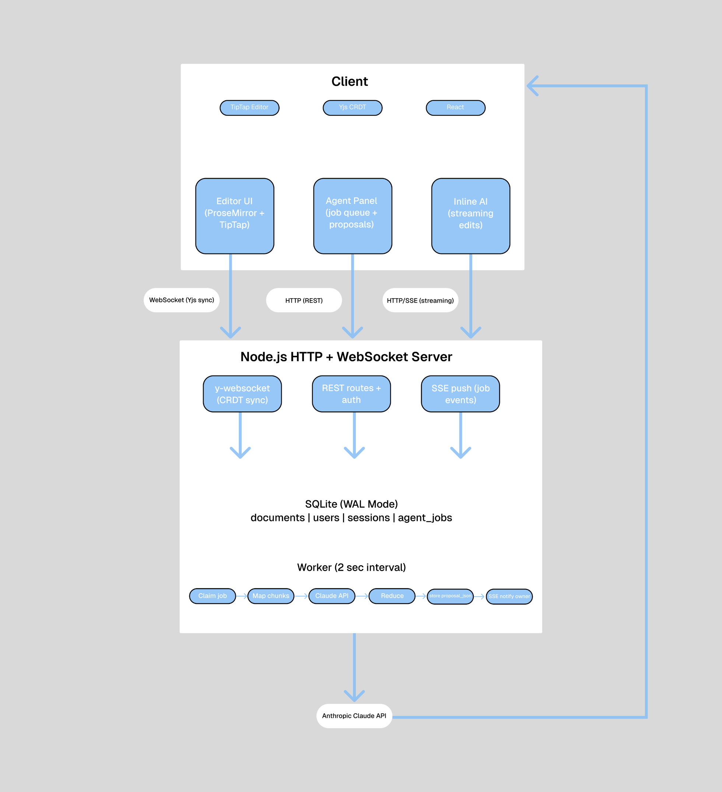
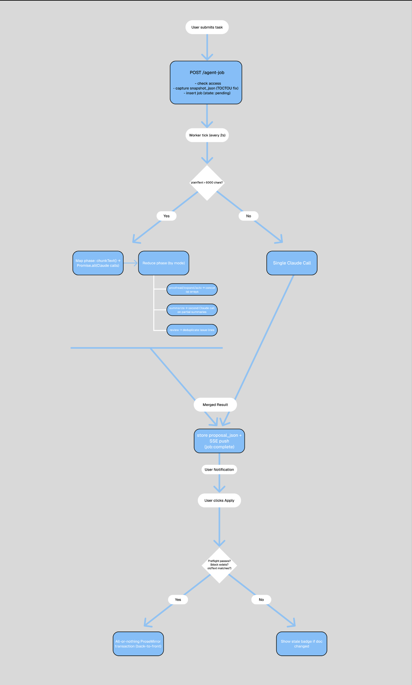

# CoWrite

Real-time collaborative document editor with AI agents, CRDT sync, and a structured proposal system for reviewing and applying AI edits.

---

## Screenshots

[Image Placeholder: Main editor with agent panel open — hero shot with real document content, completed agent job, and `Apply changes` visible]

[Image Placeholder: Proposal apply flow — completed proposal showing op count and the `Apply changes` button, ideally with visible document changes after applying]

[Image Placeholder: Inline AI streaming — done-state result bar with `Undo`, `Keep & insert`, and `Chat more` visible below a selection]

[Image Placeholder: Multiplayer cursors — two browser windows side by side, different user colors, both editing the same document]

[Image Placeholder: Agent stats in settings — settings popover showing real p50/p95 latency numbers and estimated cost]

---

## Architecture

### System Overview

CoWrite is split into three main pieces:

- A React + TipTap client for rich-text editing, inline AI interactions, and proposal review.
- A Node.js server that handles authentication, document access control, REST APIs, SSE events, and Yjs WebSocket sync.
- A background worker that processes agent jobs asynchronously, stores results, and notifies the client when work is complete.

Document state is stored as Yjs updates in SQLite rather than as plain text. That keeps the CRDT state intact and allows the server to reconstruct the latest collaborative state directly from the database.

### Agent Job Lifecycle

Agent jobs are intentionally decoupled from the editor so users can keep writing while AI work happens in the background:

1. A user submits an agent task from the editor.
2. The server captures a frozen snapshot of the document and inserts a pending job into SQLite.
3. The worker claims the job atomically, calls Claude, and stores either structured proposal ops or text results.
4. The server pushes completion over SSE.
5. The user reviews the result and explicitly applies it if it is still valid.

---

## Key Technical Decisions

### CRDTs over Operational Transformation

CoWrite uses Yjs, which implements a CRDT (Conflict-free Replicated Data Type) for document sync. Each client keeps a replica of the document, and concurrent edits merge through the data structure itself rather than through a centralized transform pipeline.

The practical tradeoff is that the server does not need to serialize or transform every edit. It mainly acts as a relay and persistence layer, while Yjs handles merging. This also makes the collaboration model more tolerant of temporary disconnects and reconnections.

Yjs awareness state, such as cursor presence and AI typing indicators, is ephemeral. It is shared live between connected clients but is not persisted to SQLite.

### SQLite WAL Mode

SQLite runs in WAL (write-ahead log) mode. This matters because the app has multiple concurrent readers and writers:

- the document server reads and saves collaborative state
- the worker reads documents and updates agent jobs
- REST routes read and update sharing, preferences, and job metadata

WAL mode allows those reads and writes to overlap more cleanly than default journal mode.

Documents are stored as binary Yjs state blobs rather than normalized text rows. The point is to preserve the full collaborative document state directly, instead of trying to map rich collaborative editing into a relational schema.

### Atomic Job Claiming

The worker claims jobs with a single SQL `UPDATE ... RETURNING *` statement. That avoids the usual race where two workers both read the same pending job before either has updated it.

The claim logic also handles two failure cases in the same query:

- retrying failed jobs while attempts remain
- reclaiming jobs that were marked `running` but timed out

That keeps the queue implementation simple while still being safe under concurrency.

### Frozen Snapshot at Submit Time

When a user submits an agent job, the server immediately captures a snapshot of the document's block structure and stores it on the job row.

This solves a real async correctness problem: the worker may run seconds later, but the document is still changing. Without the snapshot, the model could generate edits against content that no longer exists in the same form by the time the result is ready.

With the snapshot in place, the worker always generates proposals against the document as it existed at submit time, not whatever the document happens to look like later.

### Structured Proposals with Two-Phase Validation

For edit-producing modes, agent output is stored as structured JSON ops such as:

- `replace_text`
- `insert_block_after`

The model does not directly mutate the document. Instead, the user reviews a proposal in the agent panel and decides whether to apply it.

CoWrite validates proposals in two phases:

- Server-side validation checks that each target block exists in the frozen snapshot and that the referenced `oldText` matches the snapshot content.
- Client-side preflight checks the same assumptions against the live document right before apply.

If the document has drifted, the proposal is marked stale and apply is aborted. If validation passes, the client applies the full proposal through a single ProseMirror transaction.

Ops are applied back-to-front so earlier replacements do not shift the positions of later ones.

### Map-Reduce for Long Documents

For larger documents, the worker switches from a single model call to a chunked map-reduce pipeline.

In the map phase, the worker splits the document into overlapping chunks and sends them to Claude in parallel. In the reduce phase, results are merged differently depending on mode:

- proposal modes merge edit op arrays
- summarize runs a second model call to combine partial summaries
- review deduplicates overlapping findings

This keeps long-document behavior responsive without requiring a separate orchestration system.

### Stable Block IDs for Edit Targeting

Block-level nodes are stamped with stable UUIDs by a ProseMirror plugin. Those IDs survive serialization and collaborative sync, which makes them a better target for AI proposals than absolute character positions.

This is what allows a proposal op to say "replace text inside block X" instead of "replace text at character offset Y," which would be much more fragile in a live collaborative editor.

---

## Features

- Real-time multiplayer editing with TipTap, ProseMirror, Yjs, and `y-websocket`
- Live cursors with presence, idle detection, and click-to-follow
- Background AI agents that run asynchronously and notify the client over SSE
- Structured proposal review with diff-style previews and explicit apply
- Inline AI for writing, rewriting, continuing, and summarizing selected content
- Undo / keep / chat-more controls for inline AI output
- Map-reduce handling for long documents
- Document sharing with per-user access control
- Per-document editor preferences persisted to the server
- Agent metrics including success rate, p50/p95 latency, per-mode stats, and estimated cost

---

## Stack

| Layer | Technology |
| --- | --- |
| Editor | TipTap, ProseMirror |
| Collaboration | Yjs, y-websocket |
| Frontend | React, TypeScript, Vite |
| Backend | Node.js HTTP server, ws |
| Database | SQLite, better-sqlite3, WAL mode |
| AI | Anthropic Claude API |
| Auth | Google OAuth2, session cookies |

---

## Future Work

- Per-op accept/reject instead of applying an entire proposal at once
- Stronger job execution primitives for multiple workers
- Versioned document history and proposal replay
- More precise token and cost accounting
- Comments, annotations, and richer collaborative review workflows
